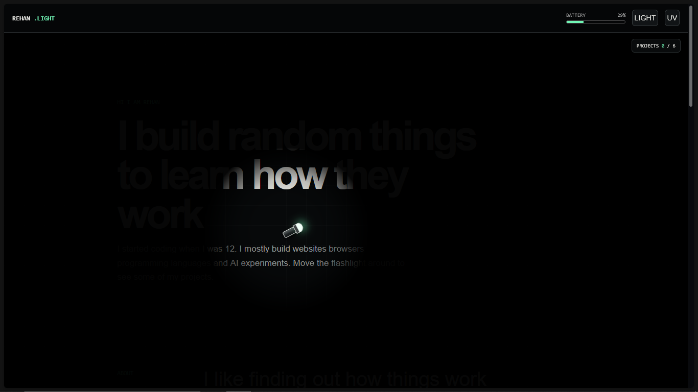

# Rehan Light

A portfolio that you explore using a flashlight.

## Description

Rehan Light is my personal portfolio but I did not want it to feel like a normal portfolio page.

The website is mostly dark and the mouse controls a flashlight. You use the light to find my projects and keep it over a project for a moment to mark it as found.

The flashlight has a battery so leaving it on all the time is not a good idea. Turning it off charges the battery again. There is also a UV mode that shows notes hidden inside the project cards.

Light is not just part of the design. The website depends on it because most of the content cannot be explored properly without the flashlight.

I built the whole project in one HTML file using HTML CSS and JavaScript.

## Screenshot



## What It Has

- A flashlight that follows the mouse
- Touch controls for phones and tablets
- A custom torch cursor
- A battery that slowly runs out
- Battery charging when the light is off
- UV mode for hidden project notes
- Projects that can be found using the light
- A counter for found projects
- Progress saved in the browser
- A five second controls screen
- Keyboard controls
- A mobile layout
- No external libraries

## Getting Started

The project runs directly in a web browser.

You do not need to install any packages or run a build command.

### Dependencies

You need:

- A modern web browser
- JavaScript enabled
- A mouse trackpad or touchscreen

A local server is useful while editing the project but it is not required.

## Installing

Clone the repository:

```bash
git clone https://github.com/rehan-kasim/port-folio.git
```

Open the project folder:

```bash
cd port-folio
```

You can also download the repository as a ZIP from GitHub and extract it.

The folder should look like this:

```text
rehan-light
├── images
│   └── rehan.light.png
├── index.html
├── README.md
└── LICENSE.md
```

Replace `YOUR-REPOSITORY-NAME` with the actual name of the GitHub repository.

## Executing the Program

The easiest way is to open `index.html` in a browser.

You can also run a small local server with Python:

```bash
python -m http.server 8000
```

Then open this address in your browser:

```text
http://localhost:8000
```

If you use Visual Studio Code:

1. Open the project folder
2. Install the Live Server extension
3. Right click `index.html`
4. Select `Open with Live Server`

## Controls

### Mouse

- Move the mouse to move the flashlight
- Hold the flashlight over a project to find it
- Click a project to open its GitHub page

### Touchscreen

- Drag a finger to move the flashlight
- Hold the light over a project to find it
- Tap a project to open it

### Keyboard

```text
F = Turn the flashlight on or off
U = Turn UV mode on or off
```

## Battery

The battery goes down while the flashlight is running.

UV mode uses more power than the normal flashlight.

Turn the flashlight off when the battery is low. The battery charges again while the light is off.

Finding a project gives the battery a small charge.

## UV Mode

UV mode changes the flashlight and shows text that cannot be seen with the normal light.

The hidden notes explain small things about why I started each project.

The regular flashlight must be on before UV mode can work.

## Saving Progress

The website saves found projects and the current battery level using browser local storage.

The saved values are:

```text
rehan-projects
rehan-battery
```

To reset everything open the browser developer console and run:

```js
localStorage.removeItem("rehan-projects")
localStorage.removeItem("rehan-battery")
location.reload()
```

## Help

### The loading screen does not close

Open the browser developer console and check for JavaScript errors.

Also make sure the complete JavaScript section is still present near the bottom of `index.html`.

### The flashlight is not visible

Try a recent version of Chrome Edge Firefox or Safari.

The flashlight uses a CSS mask. Very old browsers may not display the effect correctly.

### The battery starts at the old value

The battery is saved in the browser.

Reset only the battery with:

```js
localStorage.removeItem("rehan-battery")
location.reload()
```

### Projects are already marked as found

The project list is also saved in the browser.

Reset only the project discoveries with:

```js
localStorage.removeItem("rehan-projects")
location.reload()
```

### UV mode is not working

Turn the normal flashlight on first.

Then press:

```text
U
```

You can also use the UV button at the top of the page.

### The torch cursor does not appear on a phone

The custom torch cursor is hidden on touchscreens because a finger controls the light instead.

### The screenshot is not showing

Check that the screenshot exists at exactly this location:

```text
images/rehan.light.png
```

File names are case sensitive on some systems.

## Author

Rehan Kasim

[View my GitHub profile](https://github.com/rehan-kasim)

## License

This project is licensed under the MIT License.

See `LICENSE.md` for the full license.
